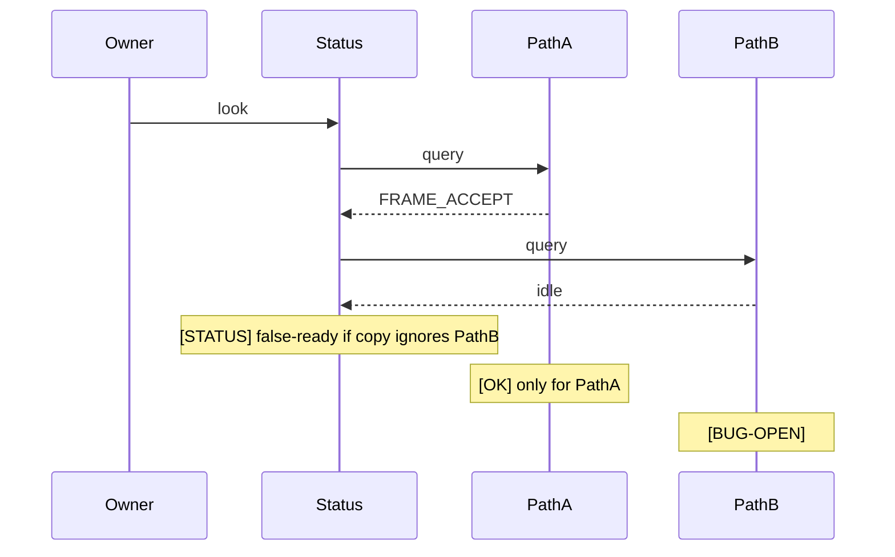

# Example scheme (generic)

This is a **shape** example, not a product map. Copy the method. Do not
treat the names as required.

---
id: example.causal.shared-status-vs-divergent-paths
layer: causal
title: Shared status line vs divergent compute paths
status: example-only · not project truth
depends_on:
  - example.skeleton.system
see_also:
  - example.impact.prepared-patch
code_anchors:
  - status writer
  - compute path A
  - compute path B
journal_markers:
  - STATUS_WRITE
  - FRAME_ACCEPT
  - FRAME_REJECT
annotations:
  - token: "[OK]"
    where: "path A ready copy matches compute after owner smoke"
    evidence_ref: "replace with a real receipt"
  - token: "[BUG-OPEN]"
    where: "path B still shows ready while compute is idle"
    evidence_ref: "replace with a real log window"
  - token: "[?]"
    where: "whether the status formula should hide idle siblings"
    evidence_ref: "owner acceptance not yet flipped"
---

# Shared status vs divergent paths

One status surface. Two compute paths. The scheme is the cheap context:
do not open the whole tree to learn this.

## Must not claim

- Path A `[OK]` does not make the whole surface `[OK]`.
- A cosmetic copy fix is not a lifecycle lock (classify A/B/C first).
