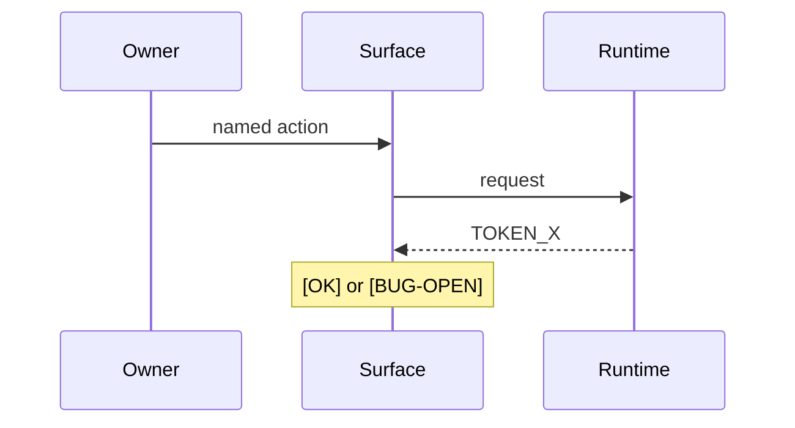

# Title

Copy this file into the adopting project's atlas. One causal scenario per
file. Keep it short. See `../SCHEMES_AND_COVERAGE_ATLAS.md`.

Replace the placeholder header fields. Keep the legend tokens closed.

## Sequence

## Must not claim

- Parent chain is `[OK]` just because this axis closed.
- Compile equals live behavior.
